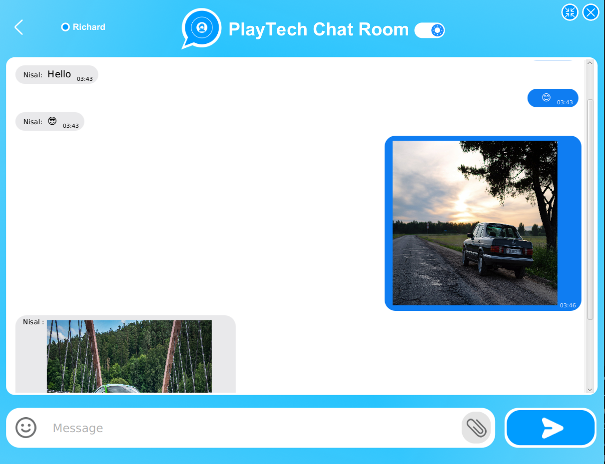
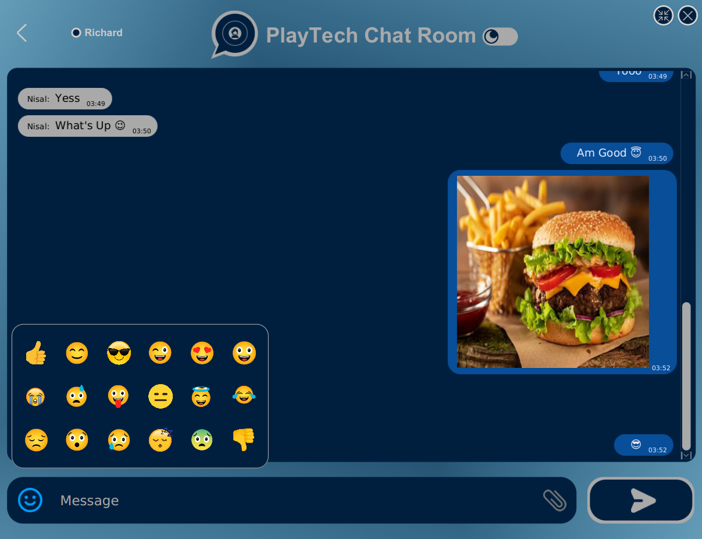

<div align="center">
  
#  PlayTech Live Chat

</div>

Welcome to Play Tech's Chat! This networked chat application, developed for Play Tech Pvt Ltd.'s customer service division, is meticulously crafted with socket programming. 

## Overview

Designed to elevate employee experience and reduce stress during work, this app seamlessly connects support team members. It transforms customer interactions into a dynamic and stress-free experience, empowering the Play Tech support team with a user-friendly platform. 

Embrace a more engaging and supportive work environment with the PlayTech Chat application, developed with cutting-edge socket programming techniques.

## Table of Contents

- [Visual Insights](#visual-insights)
- [Features](#features)
- [Getting Started](#getting-started)
  - [Prerequisites](#prerequisites)
  - [Installation](#installation)
- [Usage](#usage)
- [License](#license)

## Visual Insights

<div align="center">

<br> <br>

</div> <br>

## Features

- Seamless User Authentication: Log in effortlessly to the chat room using a personalized username.
- Versatile Messaging: Share messages, emojis, and even photos with other users, fostering dynamic communication.
- Flexible User Interaction: Join, leave, or minimize the chat at your convenience, providing flexibility in participation.
- Personalized Theme Preferences: Tailor your chat experience with the option to switch between the visually appealing dark and light modes.

## Getting Started

### Prerequisites

Before you begin, ensure you have met the following requirements:

- Java Development Kit 11 (JDK) installed.
- Integrated Development Environment (IDE) like IntelliJ IDEA or Eclipse.

### Installation

1. Clone the repository:

   ```bash
   https://github.com/gayanukabulegoda/Live-Chat-Room.git
   ```

2. Open the project in your IDE.
3. Build and run the application.

## Usage

To run the project, follow these steps:

1. Open the project in your IDE.
2. Build and run the application.

For any additional inquiries or information, please do not hesitate to contact me at <a href="mailto:grbulegoda@gmail.com">grbulegoda@gmail.com</a>

## License

This project is licensed under [MIT License](LICENSE).

##
<div align="center">
<a href="https://github.com/gayanukabulegoda" target="blank"></a>
<a href="https://git-scm.com/" target="blank"></a>
<a href="https://jdk.java.net/java-se-ri/11-MR2" target="blank"></a>
<a href="https://docs.oracle.com/en/java/javase/11/docs/api/java.desktop/javax/swing/text/html/CSS.html" target="blank"></a>
<a href="https://www.jetbrains.com/idea/download/?section=linux" target="blank"></a>
<a href="https://linuxmint.com/download_all.php" target="blank"></a>
</div> <br>
<p align="center">
  &copy; 2023 Gayanuka Bulegoda
</p>
